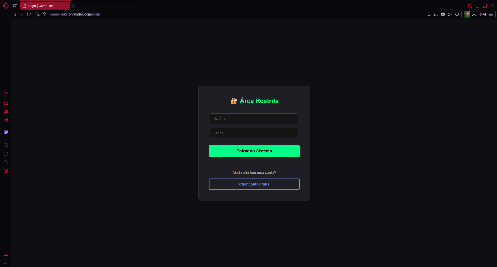
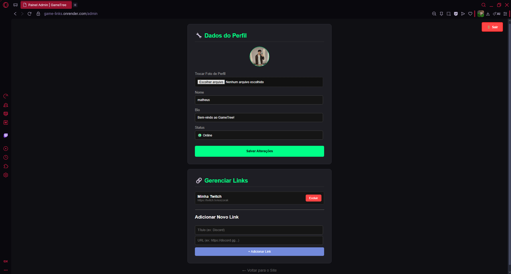
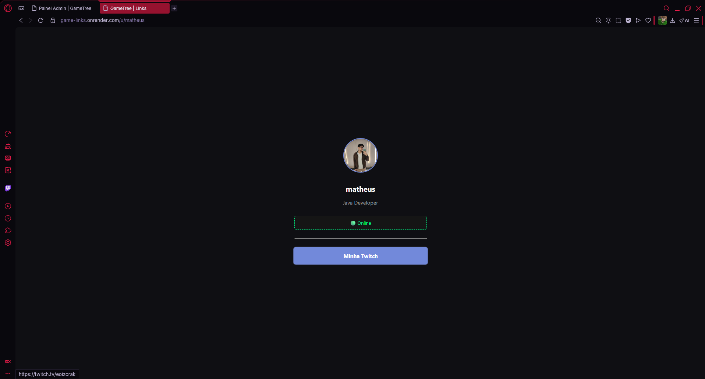
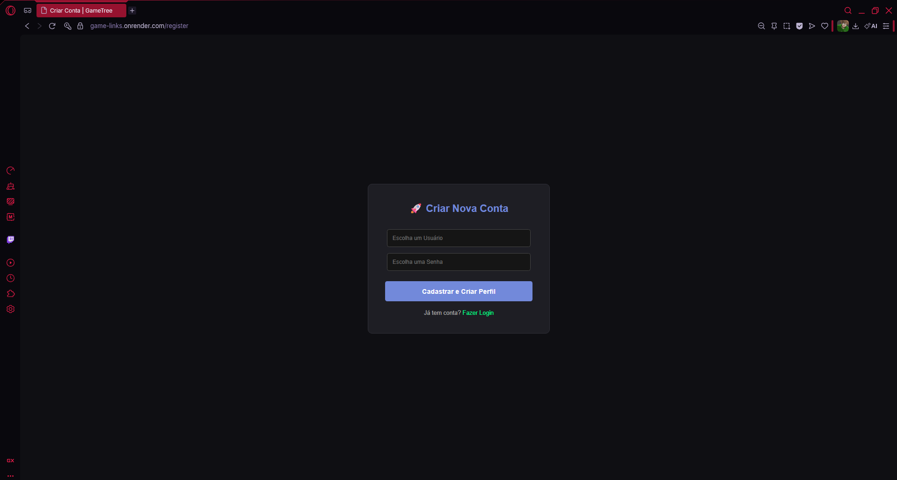

# 🎮 GameTree

> Um agregador de links personalizado para Gamers e Streamers.

---

## 💻 Sobre o Projeto

O **GameTree** é uma aplicação Fullstack desenvolvida para resolver um problema simples: centralizar a presença digital de jogadores e criadores de conteúdo em um único link compartilhável.

Este projeto foi construído com foco principal no **Backend**, visando praticar e solidificar conhecimentos em arquitetura de software, segurança com Spring Security e manipulação de dados relacional. Embora possua uma interface visual funcional (Dark Mode), a "estrela" do projeto é a lógica do servidor.

### 🎯 Funcionalidades Principais

- **Autenticação Segura:** Sistema de Login e Registro com criptografia de senha (BCrypt) e controle de sessão.
- **Painel Administrativo:** Área restrita onde o usuário gerencia seus dados.
- **CRUD de Links:** Adicionar, editar e remover links de redes sociais/plataformas.
- **Upload de Imagem:** Conversão e armazenamento de foto de perfil (Base64).
- **Perfil Público:** Página acessível publicamente com a lista de links do usuário (ex: `gametree.com/u/matheus`).

---

## 🛠 Tecnologias Utilizadas

### Backend
- **Java 17**: Linguagem principal.
- **Spring Boot**: Framework para agilidade no desenvolvimento.
- **Spring Security**: Gerenciamento de autenticação e autorização.
- **Spring Data JPA / Hibernate**: Camada de persistência de dados.
- **Maven**: Gerenciador de dependências.

### Frontend
- **HTML5 & CSS3**: Estrutura e estilização (Tema Dark).
- **JavaScript**: Manipulação de DOM e lógica de upload.
- **Thymeleaf**: Template Engine para renderização server-side.

### Banco de Dados & Infra
- **PostgreSQL**: Banco de dados relacional.
- **Render**: Plataforma de Cloud e Deploy.

---

## 📸 Screenshot

| Login | Admin Dashboard |
|:---:|:---:|
|  |  |

| Perfil Público | Registro |
|:---:|:---:|
|  |  |

> *Nota: O layout foi desenvolvido com foco em funcionalidade e usabilidade.*

---

## 🚀 Como Executar o Projeto

### Pré-requisitos
- Java 17 instalado.
- PostgreSQL instalado e rodando.
- Maven (opcional, pois o projeto possui wrapper).
